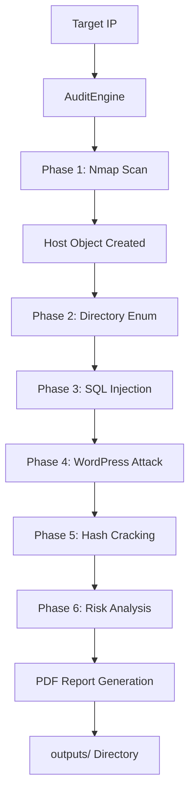

## Overview

The Ethical Audit Framework follows a modular architecture with clear separation of concerns. The system orchestrates multiple security tools through a unified audit engine, collecting and analyzing results to generate comprehensive security reports.

## Project Structure

The framework is organized into the following directory structure:

```
ethical-audit-framework/
├── main.py                 # CLI menu and user interaction
├── audit_engine.py         # Core orchestration engine
├── config.py              # Configuration and constants
├── models/                # Data models
│   ├── host.py           # Host data structure
│   └── vuln.py           # Vulnerability and risk enums
├── services/              # Attack modules
│   ├── nmap_scanner.py   # Port scanning
│   ├── gobuster_enum.py  # Directory enumeration
│   ├── sqlmap_inject.py  # SQL injection
│   ├── wpforce_brute.py  # WordPress brute force
│   ├── hash_cracker.py   # Password cracking
│   └── risk_analyzer.py  # Risk assessment
└── reporter/              # Report generation
    └── pdf_generator.py  # PDF report creation
```

## Module Responsibilities

### Entry Point: main.py

Provides an interactive Rich-based CLI menu with the following capabilities:

- Full audit execution (all attack vectors)
- Network discovery with automated targeting
- Individual attack module execution
- Custom target specification

```python main.py
# Example: Full audit execution
if choice == "1":
    rprint(f"\n[bold green]🚀 Auditoría completa contra {TARGET}[/bold green]")
    AuditEngine(TARGET).run_full_audit()
```

### Core Orchestrator: audit_engine.py

The `AuditEngine` class coordinates the entire audit workflow through six sequential phases. It maintains the central `Host` object that accumulates findings from all modules.

<Tip>
The audit engine follows a pipeline pattern where each phase enriches the `Host` object with new data that subsequent phases can leverage.
</Tip>

### Configuration: config.py

Centralizes all configuration constants:

```python config.py
class Config:
    OUTPUT_BASE = Path("outputs")
    DEFAULT_TARGET = '192.168.56.102'
    DEFAULT_NETWORK = '192.168.56.0/24'
    
    # DVWA credentials
    DVWA_DEFAULT_USER = 'admin'
    DVWA_DEFAULT_PASS = 'password'
    
    # Wordlists
    WORDLIST_PATH = '/usr/share/wordlists/rockyou.txt'
    GOBUSTER_WORDLIST = '/usr/share/wordlists/dirb/common.txt'
```

### Data Models: models/

#### Host Model (host.py)

The central data structure that aggregates all audit findings:

```python models/host.py
class Host:
    def __init__(self, ip: str):
        self.ip = ip
        self.ports_open: Dict[int, dict] = {}        # Port -> service info
        self.vulnerabilities: List[Vulnerability] = [] # Found vulns
        self.credentials: List[dict] = []              # Extracted creds
        self.directories: List[dict] = []              # Web directories
        self.os_detection: str = "No detectado"
        self.risk_level: RiskLevel = RiskLevel.LOW
```

#### Vulnerability Model (vuln.py)

Defines vulnerability structure and risk levels:

```python models/vuln.py
class RiskLevel(Enum):
    LOW = "🟢 BAJO"
    MEDIUM = "🟡 MEDIO"
    HIGH = "🟠 ALTO"
    CRITICAL = "🔴 CRÍTICO"

class Vulnerability:
    def __init__(self, name, description, port, risk, evidence_file="", recommendations=""):
        self.name = name
        self.description = description
        self.port = port
        self.risk = risk  # RiskLevel enum
        self.evidence_file = evidence_file
        self.recommendations = recommendations
```

### Attack Services: services/

Each service module follows a consistent pattern:

1. **Initialize** with target `Host` object
2. **Execute** external security tools
3. **Parse** tool output
4. **Return** findings as `Vulnerability` or credential objects

| Service | Tool | Purpose |
|---------|------|----------|
| `NmapScanner` | Nmap | Port scanning, service detection, OS fingerprinting |
| `GobusterEnum` | Gobuster | Web directory enumeration |
| `SQLMapInjector` | SQLMap | SQL injection detection and exploitation |
| `WPForceBrute` | WPScan | WordPress vulnerability scanning and brute force |
| `HashCracker` | Hashcat/John | Password hash cracking |
| `RiskAnalyzer` | Custom | Risk scoring algorithm |

### Report Generation: reporter/

The `PDFReportGenerator` creates professional audit reports with:

- Executive summary with risk assessment
- Detailed methodology documentation
- Phase-by-phase findings breakdown
- Extracted credentials table
- Prioritized security recommendations
- Evidence file references

## Data Flow Pipeline

The audit follows this sequential data flow:



### Detailed Flow

1. **Initialization**: `AuditEngine(target_ip)` creates engine instance
2. **Phase 1 (Reconnaissance)**: `NmapScanner` creates `Host` object with ports and services
3. **Phase 2 (Enumeration)**: `GobusterEnum` adds discovered directories to `Host.directories`
4. **Phase 3 (SQL Injection)**: `SQLMapInjector` appends vulnerabilities and credentials
5. **Phase 4 (WordPress)**: `WPForceBrute` adds WP-specific findings
6. **Phase 5 (Cracking)**: `HashCracker` attempts to crack extracted password hashes
7. **Phase 6 (Risk Analysis)**: `RiskAnalyzer` calculates overall risk score
8. **Report Generation**: `PDFReportGenerator` compiles all findings into PDF

<Note>
Each phase operates on the same `Host` instance, progressively enriching it with new findings. This allows later phases to leverage information discovered by earlier ones.
</Note>

## Integration with External Tools

The framework integrates with external security tools through subprocess execution and output parsing:

### Nmap Integration

```python services/nmap_scanner.py
import nmap

nm = nmap.PortScanner()
nm.scan(self.target_ip, '1-1000', arguments='-sV -sC -O --top-ports 1000')

# Parse OS detection
os_matches = nm[self.target_ip].get('osmatch', [])
if os_matches:
    best = os_matches[0]
    host.os_detection = f"{best.get('name', 'Unknown')} ({best.get('accuracy', '?')}%)"
```

### SQLMap Integration

The framework automates DVWA login, sets security level, and executes SQLMap against vulnerable endpoints:

```python
# Automated login and database dumping
sqlmap --url="http://{ip}/dvwa/vulnerabilities/sqli/?id=1" \
       --cookie="security=low; PHPSESSID={session}" \
       --dump -D dvwa -T users
```

### WPScan Integration

```python
# WordPress enumeration and brute force
wpscan --url http://{ip}/wordpress/ \
       --enumerate u,vp,ap \
       --passwords {wordlist} \
       --max-threads 10
```

## Output Directory Structure

All audit artifacts are saved to the `outputs/` directory:

```
outputs/
├── nmap/                          # Nmap scan results
│   └── {target}_scan.xml
├── sqlmap/                        # SQL injection evidence
│   └── {target}_dump.csv
├── wpscan/                        # WordPress scan results
│   └── {target}_wp_results.txt
└── REPORT_{target}_{timestamp}.pdf  # Final audit report
```

<Tip>
The output directory is automatically created by `Config.OUTPUT_BASE.mkdir(parents=True, exist_ok=True)` during initialization.
</Tip>

## Error Handling and Resilience

The architecture implements defensive programming:

- **Tool failures don't crash audits**: Each phase wraps tool execution in try/except blocks
- **Graceful degradation**: Missing data is handled with defaults (e.g., `getattr(host, 'directories', [])`)
- **Output validation**: Tool outputs are validated before parsing to prevent crashes on unexpected formats

## Performance Considerations

- **Sequential execution**: Phases run sequentially as each depends on previous results
- **Network-bound**: Performance primarily limited by network latency and target response time
- **Tool parallelization**: Some tools (WPScan) support `--max-threads` for concurrent operations
- **Disk I/O**: All evidence files are written to disk for report generation and forensic purposes

## Extension Points

The architecture supports easy extension:

1. **New attack modules**: Add to `services/` and integrate in `audit_engine.py`
2. **Custom vulnerability types**: Extend `Vulnerability` class with additional fields
3. **Alternative report formats**: Implement new reporters alongside `PDFReportGenerator`
4. **Risk scoring algorithms**: Modify `RiskAnalyzer.analyze()` logic

<CodeGroup>
```python services/custom_module.py
from models.host import Host
from models.vuln import Vulnerability, RiskLevel

class CustomAttackModule:
    def __init__(self, host: Host):
        self.host = host
    
    def attack(self):
        # Execute custom attack logic
        vulns = []
        # ... perform attack ...
        return vulns
```

```python audit_engine.py
from services.custom_module import CustomAttackModule

def run_full_audit(self):
    # ... existing phases ...
    
    # Add new phase
    rprint(f"\n[bold cyan]FASE 7: CUSTOM ATTACK[/bold cyan]")
    custom_vulns = CustomAttackModule(self.host).attack()
    self.host.vulnerabilities.extend(custom_vulns)
```
</CodeGroup>