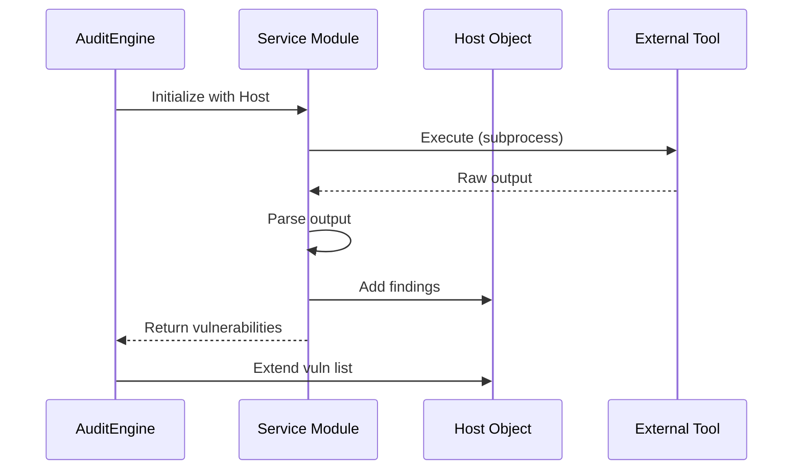

## Overview

The `AuditEngine` is the heart of the Ethical Audit Framework. It orchestrates a six-phase security audit workflow, coordinating multiple attack modules and managing the data flow from reconnaissance to final reporting.

## AuditEngine Class

The audit engine is implemented as a simple yet powerful class in `audit_engine.py`:

```python audit_engine.py
from services.nmap_scanner import NmapScanner
from services.wpforce_brute import WPForceBrute
from services.sqlmap_inject import SQLMapInjector
from services.gobuster_enum import GobusterEnum
from services.hash_cracker import HashCracker
from services.risk_analyzer import RiskAnalyzer
from reporter.pdf_generator import PDFReportGenerator
from models.host import Host

class AuditEngine:
    def __init__(self, target_ip):
        self.target_ip = target_ip
        self.host = None  # Created during Phase 1

    def run_full_audit(self):
        # Six-phase workflow implementation
        pass
```

### Initialization

The engine requires only a target IP address:

```python
engine = AuditEngine("192.168.56.102")
engine.run_full_audit()
```

<Note>
The `host` attribute is initially `None` and gets created during Phase 1 (reconnaissance). All subsequent phases operate on this shared `Host` object.
</Note>

## Six-Phase Audit Workflow

The `run_full_audit()` method executes the following phases sequentially:

### Phase 1: Reconnaissance (Nmap)

Performs comprehensive network scanning and service enumeration.

```python audit_engine.py
# FASE 1: RECONOCIMIENTO (Nmap)
rprint(f"\n[bold cyan]┌─────────────────────────────────────────┐[/bold cyan]")
rprint(f"[bold cyan]│  FASE 1: 🔍 RECONOCIMIENTO (Nmap)       │[/bold cyan]")
rprint(f"[bold cyan]└─────────────────────────────────────────┘[/bold cyan]")
self.host = NmapScanner(self.target_ip).full_scan()
```

**What happens:**
- Creates `Host` object with target IP
- Scans top 1000 ports with service version detection (`-sV`)
- Runs default scripts for additional enumeration (`-sC`)
- Attempts OS fingerprinting (`-O`)
- Populates `host.ports_open` dictionary
- Sets `host.os_detection` string

**Output example:**
```
   📡 Nmap Top 1000 + Servicios + OS Detection...
   🖥️  OS Detectado: Linux 3.2 - 4.9 (98%)
   ✅ 6 servicios detectados

   PORT         STATE      SERVICE         VERSION
   ────────────────────────────────────────────────
   22/tcp       open       ssh             OpenSSH 7.9
   80/tcp       open       http            Apache httpd 2.4.38
   3306/tcp     open       mysql           MySQL 5.7.26
```

### Phase 2: Directory Enumeration (Gobuster)

Discovers hidden web directories and files.

```python audit_engine.py
# FASE 2: ENUMERACIÓN DIRECTORIOS (Gobuster)
rprint(f"\n[bold cyan]┌─────────────────────────────────────────┐[/bold cyan]")
rprint(f"[bold cyan]│  FASE 2: 📂 DIRECTORIOS (Gobuster)      │[/bold cyan]")
rprint(f"[bold cyan]└─────────────────────────────────────────┘[/bold cyan]")
dirs = GobusterEnum(self.host).enumerate()
self.host.directories = dirs
```

**What happens:**
- Uses Gobuster/Dirb with common wordlists
- Detects accessible web paths on HTTP/HTTPS ports
- Identifies WordPress installations, DVWA, admin panels
- Stores results in `host.directories` list

**Data structure:**
```python
host.directories = [
    {'path': '/wordpress/', 'status': '200'},
    {'path': '/dvwa/', 'status': '302'},
    {'path': '/phpmyadmin/', 'status': '403'}
]
```

### Phase 3: SQL Injection (SQLMap)

Tests for and exploits SQL injection vulnerabilities in DVWA.

```python audit_engine.py
# FASE 3: SQL INJECTION + DUMP (DVWA)
rprint(f"\n[bold cyan]┌─────────────────────────────────────────┐[/bold cyan]")
rprint(f"[bold cyan]│  FASE 3: 💉 SQL INJECTION (DVWA)        │[/bold cyan]")
rprint(f"[bold cyan]└─────────────────────────────────────────┘[/bold cyan]")
sql_vulns = SQLMapInjector(self.host).attack()
self.host.vulnerabilities.extend(sql_vulns)
```

**What happens:**
1. Automatically logs into DVWA using default credentials
2. Sets security level to `low` for testing
3. Launches SQLMap against vulnerable endpoints
4. Dumps database tables (e.g., `dvwa.users`)
5. Extracts user credentials with MD5 hashes
6. Creates `Vulnerability` objects for each finding
7. Appends credentials to `host.credentials`

**Vulnerability creation:**
```python
vuln = Vulnerability(
    name="SQL Injection in DVWA",
    description="SQLMap detected injectable parameter 'id' in DVWA SQLi module",
    port=80,
    risk=RiskLevel.CRITICAL,
    evidence_file="outputs/sqlmap/session.sqlite",
    recommendations="Implement prepared statements and input validation"
)
```

### Phase 4: WordPress Attack (WPScan)

Enumerates WordPress users and performs brute-force password attacks.

```python audit_engine.py
# FASE 4: WORDPRESS (WPScan + Brute-Force)
rprint(f"\n[bold cyan]┌─────────────────────────────────────────┐[/bold cyan]")
rprint(f"[bold cyan]│  FASE 4: 🔓 WORDPRESS (WPScan)          │[/bold cyan]")
rprint(f"[bold cyan]└─────────────────────────────────────────┘[/bold cyan]")
wp_vulns = WPForceBrute(self.host).attack()
self.host.vulnerabilities.extend(wp_vulns)
```

**What happens:**
- Detects WordPress installation from Phase 2 directories
- Enumerates WordPress users with `--enumerate u`
- Scans for vulnerable plugins with `--enumerate vp,ap`
- Attempts brute force with rockyou.txt wordlist
- Adds successful credentials to `host.credentials`
- Reports plugin vulnerabilities

**Credential structure:**
```python
host.credentials.append({
    'source': 'WordPress Brute Force',
    'user': 'admin',
    'password': 'password123',
    'cracked': True
})
```

### Phase 5: Hash Cracking

Attempts to crack extracted password hashes.

```python audit_engine.py
# FASE 5: CRACKEO DE HASHES
if self.host.credentials:
    rprint(f"\n[bold cyan]┌─────────────────────────────────────────┐[/bold cyan]")
    rprint(f"[bold cyan]│  FASE 5: 🔓 CRACKEO HASHES (MD5)       │[/bold cyan]")
    rprint(f"[bold cyan]└─────────────────────────────────────────┘[/bold cyan]")
    cracked = HashCracker.crack_credentials(self.host.credentials)
    rprint(f"   [green]✅ {cracked} hash(es) crackeados[/green]")
```

**What happens:**
- Iterates through `host.credentials` looking for hashes
- Tests against common password list from `Config.COMMON_PASSWORDS`
- Uses MD5 hashing to compare against extracted hashes
- Updates credential entries with `cracked: True` flag
- Replaces hash with plaintext password when successful

<Tip>
Phase 5 only runs if credentials were extracted in previous phases. This is an example of conditional workflow based on prior findings.
</Tip>

### Phase 6: Risk Analysis

Calculates overall risk score based on all findings.

```python audit_engine.py
# FASE 6: ANÁLISIS DE RIESGO
rprint(f"\n[bold cyan]┌─────────────────────────────────────────┐[/bold cyan]")
rprint(f"[bold cyan]│  FASE 6: 🎯 ANÁLISIS DE RIESGO          │[/bold cyan]")
rprint(f"[bold cyan]└─────────────────────────────────────────┘[/bold cyan]")
RiskAnalyzer.analyze(self.host)
```

**What happens:**
- Analyzes all collected data (vulnerabilities, ports, services)
- Calculates risk score using weighted algorithm
- Sets `host.risk_level` to LOW, MEDIUM, HIGH, or CRITICAL
- Prints risk assessment to console

See [Risk Analysis](/concepts/risk-analysis) for detailed scoring algorithm.

## Module Interaction Pattern

All attack modules follow a consistent interaction pattern with the `AuditEngine`:



### Example Module Implementation

Here's how the `SQLMapInjector` follows this pattern:

```python services/sqlmap_inject.py
class SQLMapInjector:
    def __init__(self, host: Host):
        self.host = host
        self.vulnerabilities = []
    
    def attack(self):
        # 1. Execute external tool
        result = subprocess.run(
            ['sqlmap', '--url', target_url, '--dump'],
            capture_output=True
        )
        
        # 2. Parse output
        if 'vulnerable' in result.stdout:
            vuln = Vulnerability(
                name="SQL Injection",
                description="Injectable parameter detected",
                port=80,
                risk=RiskLevel.CRITICAL
            )
            self.vulnerabilities.append(vuln)
            
            # 3. Extract additional data
            credentials = self._parse_dumped_data(result.stdout)
            self.host.credentials.extend(credentials)
        
        # 4. Return findings
        return self.vulnerabilities
```

## Host Model as Central Data Store

The `Host` object serves as the central accumulator for all audit findings:

```python models/host.py
class Host:
    def __init__(self, ip: str):
        self.ip = ip
        self.ports_open: Dict[int, dict] = {}
        self.vulnerabilities: List[Vulnerability] = []
        self.credentials: List[dict] = []
        self.directories: List[dict] = []
        self.os_detection: str = "No detectado"
        self.risk_level: RiskLevel = RiskLevel.LOW
```

### Data Evolution Through Phases

<Steps>
  <Step title="Phase 1: Host Creation">
    ```python
    host = Host(ip="192.168.56.102")
    host.ports_open = {22: {...}, 80: {...}, 3306: {...}}
    host.os_detection = "Linux 3.2 - 4.9 (98%)"
    ```
  </Step>
  
  <Step title="Phase 2: Directory Discovery">
    ```python
    host.directories = ['/wordpress/', '/dvwa/', '/phpmyadmin/']
    ```
  </Step>
  
  <Step title="Phase 3: SQL Injection">
    ```python
    host.vulnerabilities.append(sqli_vuln)
    host.credentials.extend(extracted_users)
    ```
  </Step>
  
  <Step title="Phase 4: WordPress Attack">
    ```python
    host.vulnerabilities.append(wp_vuln)
    host.credentials.append(admin_cred)
    ```
  </Step>
  
  <Step title="Phase 5: Hash Cracking">
    ```python
    # Updates existing credentials in-place
    host.credentials[0]['cracked'] = True
    host.credentials[0]['password'] = 'plaintextpw'
    ```
  </Step>
  
  <Step title="Phase 6: Risk Calculation">
    ```python
    host.risk_level = RiskLevel.CRITICAL
    ```
  </Step>
</Steps>

## Credential Summary and Reporting

After all attack phases complete, the engine displays a credential summary:

```python audit_engine.py
if self.host.credentials:
    rprint(f"\n[bold red]{'='*60}[/bold red]")
    rprint(f"[bold red]🔑 CREDENCIALES EXTRAÍDAS: {len(self.host.credentials)}[/bold red]")
    rprint(f"[bold red]{'='*60}[/bold red]")
    rprint(f"\n   [bold]{'FUENTE':<22} {'USUARIO':<15} {'CONTRASEÑA'}[/bold]")
    rprint(f"   {'─'*55}")
    for cred in self.host.credentials:
        src = cred.get('source', 'N/A')[:20]
        user = cred.get('user', 'N/A')
        pwd = cred.get('password', 'N/A')
        cracked = '✅' if cred.get('cracked') else '🔒'
        rprint(f"   [green]{src:<22} {user:<15} {pwd} {cracked}[/green]")
```

**Example output:**
```
🔑 CREDENCIALES EXTRAÍDAS: 5

   FUENTE                  USUARIO         CONTRASEÑA
   ───────────────────────────────────────────────────────
   SQLi DVWA dump          admin           password ✅
   SQLi DVWA dump          gordonb         abc123 ✅
   SQLi DVWA dump          1337            charley ✅
   WordPress Brute         admin           password123 ✅
   WordPress Brute         editor          welcome1 ✅
```

## PDF Report Generation

The final phase generates a comprehensive PDF report:

```python audit_engine.py
# REPORTE PDF
rprint(f"\n[bold cyan]┌─────────────────────────────────────────┐[/bold cyan]")
rprint(f"[bold cyan]│  📄 GENERANDO REPORTE PDF               │[/bold cyan]")
rprint(f"[bold cyan]└─────────────────────────────────────────┘[/bold cyan]")
PDFReportGenerator(self.host).generate()
```

The report includes:
- Cover page with risk level and statistics
- Executive summary
- Detailed methodology
- Phase-by-phase findings
- Credentials table
- Risk analysis with scoring breakdown
- Prioritized recommendations

## Final Summary Display

The audit concludes with a comprehensive summary:

```python audit_engine.py
rprint(f"\n[bold green]{'='*60}[/bold green]")
rprint(f"[bold green]✅ AUDITORÍA TERMINADA![/bold green]")
rprint(f"[bold green]{'='*60}[/bold green]")
rprint(f"   📊 Puertos abiertos:     {len(self.host.ports_open)}")
rprint(f"   📂 Directorios encontrados: {len(getattr(self.host, 'directories', []))}")
rprint(f"   🐛 Vulnerabilidades:     {len(self.host.vulnerabilities)}")
rprint(f"   🔑 Credenciales:         {len(self.host.credentials)}")
rprint(f"   🎯 Riesgo:               {self.host.risk_level.value}")
rprint(f"   📁 Resultados:           outputs/")
rprint(f"   📄 Reporte PDF:          outputs/REPORT_{self.target_ip.replace('.','_')}_*.pdf")
```

## Usage Examples

### Full Audit from Python

```python
from audit_engine import AuditEngine

# Run complete audit
engine = AuditEngine("192.168.1.100")
engine.run_full_audit()

# Access results
print(f"Found {len(engine.host.vulnerabilities)} vulnerabilities")
print(f"Risk level: {engine.host.risk_level.value}")
```

### Automated Network Scanning

```python
from services.nmap_scanner import NmapScanner
from audit_engine import AuditEngine

# Discover network hosts
hosts = NmapScanner.discover_network('192.168.1.0/24')

# Audit each host
for ip in hosts:
    print(f"Auditing {ip}...")
    AuditEngine(ip).run_full_audit()
```

## Error Handling

The audit engine implements defensive error handling:

- **Tool failures**: Each phase catches exceptions to prevent audit abortion
- **Missing data**: Uses `getattr(host, 'directories', [])` for safe attribute access
- **Network timeouts**: Tool execution includes timeout parameters
- **Invalid targets**: Validation occurs before expensive operations

<Warning>
The audit engine requires root/sudo privileges for certain operations like OS detection and SYN scans. Always run in a controlled, authorized environment.
</Warning>

## Performance Characteristics

- **Sequential execution**: Phases cannot be parallelized due to dependencies
- **Average duration**: 5-15 minutes per target depending on:
  - Number of open ports
  - Size of brute-force wordlist
  - SQLMap enumeration depth
  - Network latency
- **Resource usage**: CPU-light, network-intensive
- **Disk usage**: Evidence files typically 1-10 MB per audit

## Extending the Audit Engine

Add new phases by following the established pattern:

```python audit_engine.py
def run_full_audit(self):
    # ... existing phases ...
    
    # FASE 7: CUSTOM ATTACK
    rprint(f"\n[bold cyan]FASE 7: YOUR ATTACK[/bold cyan]")
    from services.custom_attack import CustomAttack
    custom_vulns = CustomAttack(self.host).attack()
    self.host.vulnerabilities.extend(custom_vulns)
    
    # Continue with risk analysis and reporting
    RiskAnalyzer.analyze(self.host)
    PDFReportGenerator(self.host).generate()
```

The modular architecture makes it straightforward to add new attack vectors while maintaining the consistent workflow and reporting structure.